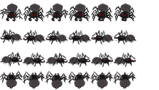

# Spider Game 🕷️

A fast-paced web hunting arcade game built with Next.js 16, React 19, and TypeScript. Control a spider in a beautiful atmospheric night environment—spin webs to trap prey, zip across the screen, build combos, and survive as long as you can!

🎮 **[Play Now](https://spiderdemo.vercel.app/)**



## ✨ Features

### Gameplay

- **Web Shooting** — Click to shoot webs that trap passing prey
- **Zip Movement** — Right-click to zip quickly toward any location
- **Combo System** — Chain catches for multiplier bonuses up to 10x
- **Power-ups** — Collect speed boosts, web energy refills, prey magnets, and slow motion
- **Progressive Difficulty** — Game scales as your score increases
- **High Score Tracking** — Persistent local storage for your best scores

### Prey Types

| Prey         | Behavior            | Points |
| ------------ | ------------------- | ------ |
| 🦋 Moth      | Wandering           | 100    |
| ✨ Firefly   | Hovering, glowing   | 150    |
| 🪲 Beetle    | Slow, armored       | 200    |
| 🦋 Butterfly | Erratic movement    | 250    |
| 🪰 Dragonfly | Fast, hard to catch | 300    |

### Visual Effects

- Atmospheric starlit night sky with aurora effects
- Dynamic particle systems for all interactions
- Smooth 60fps sprite animations
- Screen shake and combo celebrations
- Procedural moon, shooting stars, and ambient fog

### Audio

- Procedurally generated sound effects using Web Audio API
- No external audio files required
- Toggle sound on/off in-game

### Controls

- **Full keyboard + mouse support** for desktop
- **Touch controls** with virtual joystick for mobile
- **Tutorial system** for new players

## 🎮 How to Play

### Desktop Controls

| Input                        | Action          |
| ---------------------------- | --------------- |
| `W` `A` `S` `D` / Arrow Keys | Move            |
| `Space`                      | Jump            |
| `Shift`                      | Run (hold)      |
| `Left Click`                 | Shoot Web       |
| `Right Click`                | Zip to location |
| `Escape`                     | Pause           |

### Mobile Controls

- **Left joystick** — Movement
- **Jump button** — Jump
- **Web button** — Shoot web forward
- **Zip button** — Quick dash in facing direction

### Tips

- Trap prey in webs before catching them for easier collection
- Build combos by catching prey in quick succession
- Manage your web energy—it regenerates over time
- Power-ups spawn when catching prey, especially during combos
- Dragonflies are worth the most but hardest to catch!

## 🛠️ Tech Stack

### Core

| Package                                       | Version | Purpose                         |
| --------------------------------------------- | ------- | ------------------------------- |
| [Next.js](https://nextjs.org/)                | 16.0.3  | React framework with App Router |
| [React](https://react.dev/)                   | 19.0.0  | UI library                      |
| [TypeScript](https://www.typescriptlang.org/) | 5.x     | Type safety                     |

### State & Animation

| Package                                         | Version  | Purpose                 |
| ----------------------------------------------- | -------- | ----------------------- |
| [Zustand](https://zustand-demo.pmnd.rs/)        | 5.0.8    | Global state management |
| [Framer Motion](https://www.framer.com/motion/) | 12.23.24 | Animation library       |

### Styling

| Package                                  | Version | Purpose           |
| ---------------------------------------- | ------- | ----------------- |
| [Tailwind CSS](https://tailwindcss.com/) | 4.0.8   | Utility-first CSS |
| [PostCSS](https://postcss.org/)          | 8.4.47  | CSS processing    |

### Development

| Package                                                                       | Version | Purpose              |
| ----------------------------------------------------------------------------- | ------- | -------------------- |
| [ESLint](https://eslint.org/)                                                 | 9.15.0  | Code linting         |
| [eslint-config-next](https://nextjs.org/docs/app/api-reference/config/eslint) | 16.0.3  | Next.js ESLint rules |

## 🚀 Getting Started

### Prerequisites

- **Node.js** 18.17 or higher
- **npm**, **yarn**, **pnpm**, or **bun**

### Installation

1. **Clone the repository**

   ```bash
   git clone https://github.com/brown2020/spider.git
   cd spider
   ```

2. **Install dependencies**

   ```bash
   npm install
   # or
   yarn install
   # or
   pnpm install
   ```

3. **Start the development server**

   ```bash
   npm run dev
   ```

4. **Open your browser**
   Navigate to [http://localhost:3000](http://localhost:3000)

### Build for Production

```bash
npm run build
npm start
```

## 📁 Project Structure

```
spider/
├── public/
│   └── spider-sprite.png      # Spider sprite sheet
├── src/
│   ├── app/
│   │   ├── layout.tsx         # Root layout with metadata
│   │   ├── page.tsx           # Home page (game entry)
│   │   ├── globals.css        # Global styles & animations
│   │   └── fonts/             # Custom fonts (Geist)
│   ├── components/
│   │   ├── ClientWrapper.tsx  # Client-side game loader
│   │   ├── game/
│   │   │   ├── GameContainer.tsx  # Main game orchestrator
│   │   │   ├── Spider.tsx         # Player character
│   │   │   ├── Prey.tsx           # Prey entities
│   │   │   ├── Webs.tsx           # Web projectiles
│   │   │   ├── Particles.tsx      # Particle effects
│   │   │   ├── PowerUps.tsx       # Power-up collectibles
│   │   │   └── Environment.tsx    # Background & atmosphere
│   │   └── ui/
│   │       ├── HUD.tsx            # Score, energy, combos
│   │       ├── Menu.tsx           # Main/pause/game over menus
│   │       ├── Controls.tsx       # Touch controls & help
│   │       └── Tutorial.tsx       # New player tutorial
│   ├── hooks/
│   │   ├── useGameLoop.ts         # Game loop & input handling
│   │   └── useSpriteAnimation.ts  # Sprite frame animation
│   ├── stores/
│   │   └── gameStore.ts           # Zustand global state
│   └── lib/
│       ├── constants/
│       │   ├── gameConfig.ts      # All game tuning values
│       │   └── sprites.ts         # Sprite sheet definitions
│       ├── types/
│       │   └── game.ts            # TypeScript interfaces
│       └── utils/
│           ├── particles.ts       # Particle factory functions
│           └── sound.ts           # Web Audio sound manager
├── package.json
├── tsconfig.json
├── next.config.mjs
├── postcss.config.mjs
└── README.md
```

## ⚙️ Configuration

All game balance values are centralized in `src/lib/constants/gameConfig.ts`:

```typescript
GAME_CONFIG = {
  spider: { baseSpeed, runSpeed, jumpForce, catchRadius, ... },
  physics: { gravity, friction, zipSpeed, ... },
  web: { duration, energy: { max, regenRate, shootCost }, ... },
  prey: { baseSpawnRate, maxOnScreen, fleeRadius, ... },
  combo: { duration, multiplierCap, ... },
  difficulty: { scaleRate, maxMultiplier, ... },
  powerUp: { spawnChance, duration, effects: { ... } },
  particles: { maxCount, ... },
  effects: { screenShakeDuration, scorePopupDuration },
}
```

## 🎨 Customization

### Adding New Prey Types

1. Add the type to `PreyType` in `src/lib/types/game.ts`
2. Add configuration to `PREY_TYPES` in `src/lib/constants/gameConfig.ts`
3. Create the sprite component in `src/components/game/Prey.tsx`

### Adding New Power-ups

1. Add the type to `PowerUpType` in `src/lib/types/game.ts`
2. Add configuration to `POWER_UP_CONFIG` in `src/lib/constants/gameConfig.ts`
3. Handle the effect in `collectPowerUp` in `src/stores/gameStore.ts`

### Modifying Sounds

All sounds are procedurally generated in `src/lib/utils/sound.ts`. Adjust `SOUND_CONFIGS` to change frequencies, durations, and waveforms.

## 🗺️ Roadmap

- [x] Web shooting mechanics
- [x] Touch controls for mobile
- [x] Procedural sound effects
- [x] Multiple prey types with unique behaviors
- [x] Combo system
- [x] Power-up system
- [x] Tutorial system
- [ ] Level/stage system with unique environments
- [ ] Boss encounters
- [ ] Achievements system
- [ ] Online leaderboards
- [ ] Multiplayer co-op mode

## 🤝 Contributing

Contributions are welcome! Here's how to get started:

1. **Fork** the repository
2. **Create** a feature branch
   ```bash
   git checkout -b feature/amazing-feature
   ```
3. **Make** your changes with clear commit messages
4. **Test** your changes thoroughly
   ```bash
   npm run build
   ```
5. **Push** to your fork
   ```bash
   git push origin feature/amazing-feature
   ```
6. **Open** a Pull Request

### Development Guidelines

- Follow the existing code style (Prettier formatting applied)
- Use TypeScript strictly—avoid `any` types
- Keep components focused and composable
- Add new constants to `gameConfig.ts` instead of hardcoding values
- Test on both desktop and mobile before submitting

## 📝 License

This project is licensed under the MIT License—see the [LICENSE](LICENSE) file for details.

## 🙏 Acknowledgments

- Sprite artwork created for this project
- Built with [Next.js](https://nextjs.org/) by Vercel
- State management by [Zustand](https://github.com/pmndrs/zustand)
- Animations powered by [Framer Motion](https://www.framer.com/motion/)

## 📧 Contact

- **Email**: info@ignitechannel.com
- **Project**: [github.com/brown2020/spider](https://github.com/brown2020/spider)
- **Live Demo**: [spiderdemo.vercel.app](https://spiderdemo.vercel.app/)

---

<p align="center">
  Made with 🕸️ by <a href="https://github.com/brown2020">brown2020</a>
</p>
